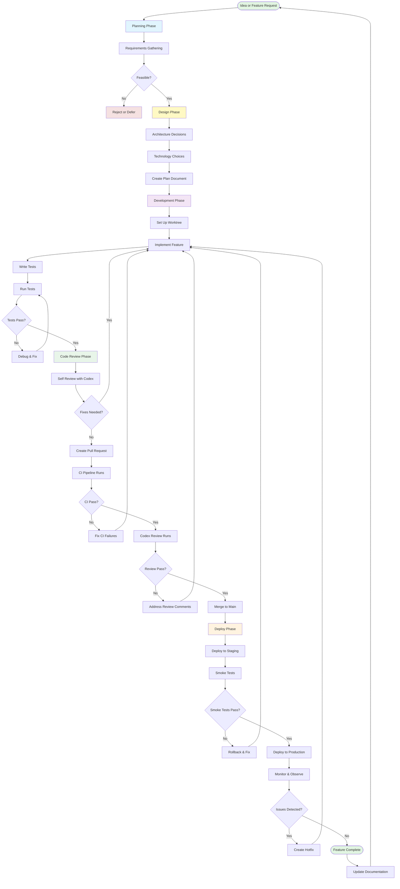

# Comprehensive Development Workflow Guide with Codex

**A complete guide to professional-grade development using OpenAI Codex as your AI teammate.**

---

## Table of Contents

1. [Repository Review: OpenClaw Status](#repository-review-openclaw-status)
2. [Understanding Your Development Stack](#understanding-your-development-stack)
3. [Complete Software Development Lifecycle](#complete-software-development-lifecycle)
4. [Codex macOS App Features](#codex-macos-app-features)
5. [Automations & Skills Guide](#automations--skills-guide)
6. [Step-by-Step Workflows with Starter Prompts](#step-by-step-workflows-with-starter-prompts)
7. [Position Indicators: Knowing Where You Are](#position-indicators-knowing-where-you-are)

---

## Repository Review: OpenClaw Status

### Current State Assessment

**What OpenClaw Is:**
OpenClaw is a Personal AI Assistant platform that provides multi-channel messaging capabilities. Think of it as your own AI assistant that can communicate with you through WhatsApp, Telegram, Slack, Discord, SMS, and more.

**Technical Stack:**
- **Language:** TypeScript and JavaScript (requires Node.js version 22 or higher)
- **Frontend:** React with Vite (a fast build tool)
- **Backend:** Convex (a backend-as-a-service platform)
- **Architecture:** Mission Control framework with Test-Driven Development (TDD)

### What You're Doing Right ✅

1. **Modern TypeScript Stack**
   - TypeScript provides type safety, which catches errors before code runs
   - Using the latest Node.js (v22+) ensures access to modern JavaScript features
   - React + Vite is a fast, modern frontend combination

2. **Convex Backend Integration**
   - Convex handles database, authentication, and real-time updates
   - Reduces backend complexity significantly
   - Built-in reactive data synchronization

3. **Multi-Channel Messaging Support**
   - Supports 10+ messaging platforms (WhatsApp, Telegram, Slack, Discord, SMS, etc.)
   - Unified API for different channels
   - Flexible message routing

4. **CI/CD Pipeline**
   - GitHub Actions workflow in place (`.github/workflows/ci.yml`)
   - Codex code review integration set up
   - Automated testing on pull requests

5. **Test-Driven Development (TDD)**
   - Mission Control framework emphasizes TDD
   - Tests written before features
   - Red-Green-Refactor cycle

### What Still Needs to Be Done ⚠️

1. **Codex Auto-Fix Workflow**
   - The `codex-autofix.yml` workflow has incorrect trigger conditions
   - Needs to trigger on `pull_request_review_comment` events, not `pull_request: [reviewed, submitted]`
   - See `ANALYSIS.md` for detailed root cause analysis

2. **AGENTS.md Configuration**
   - No project-specific `AGENTS.md` file found at repository root
   - AGENTS.md tells Codex about your code conventions, review guidelines, and project rules
   - Should include information about:
     - Code style preferences
     - Testing conventions
     - Security requirements
     - Architecture patterns

3. **PLANS.md for Complex Changes**
   - No PLANS.md file for multi-hour problem solving
   - PLANS.md lets you review and approve plans before implementation
   - Useful for large refactors, migrations, or architectural changes

4. **Codex macOS App Integration**
   - No evidence of Worktrees setup for parallel development
   - No Automations configured for scheduled tasks
   - No Skills created for reusable workflows

5. **Documentation Coverage**
   - API documentation needs improvement
   - Architecture diagrams would help onboarding
   - Contribution guidelines could be clearer

### Recommended Next Steps

**Priority 1 (Immediate): Fix Codex Auto-Fix Workflow**
```yaml
# Change this in .github/workflows/codex-autofix.yml:
on:
  pull_request_review_comment:  # Changed from pull_request
    types: [created, edited]
  pull_request_review:
    types: [submitted, edited]
```

**Priority 2 (This Week): Create AGENTS.md**
- Create `AGENTS.md` at repository root
- Include project-specific guidelines for Codex
- Cover code style, testing, and security rules

**Priority 3 (This Month): Set Up Codex macOS App Features**
- Create Worktrees for parallel development
- Set up Automations for daily tasks
- Create Skills for common workflows

---

## Understanding Your Development Stack

### What Each Component Does

**Frontend (React + Vite):**
- **React** is a JavaScript library for building user interfaces
- **Vite** is a build tool that starts your development server instantly
- When you change code, Vite shows updates immediately without full page reloads

**Backend (Convex):**
- **Convex** provides database, functions, and real-time updates
- You write functions in TypeScript that run on Convex servers
- Data automatically syncs to all connected clients in real-time

**TypeScript:**
- **TypeScript** is JavaScript with types added
- Types catch errors before you run your code
- Examples: `string`, `number`, `boolean`, `Array<string>`, etc.

### How Data Flows in Your Application

```
┌─────────────────────────────────────────────────────────────┐
│                     USER INTERACTION                         │
└────────────────────────┬────────────────────────────────────┘
                         │
                         ▼
┌─────────────────────────────────────────────────────────────┐
│                      REACT FRONTEND                          │
│  (User interface, forms, message display)                   │
└────────────────────────┬────────────────────────────────────┘
                         │
                         ▼
┌─────────────────────────────────────────────────────────────┐
│                       CONVEX BACKEND                         │
│  (Database, business logic, message processing)              │
└────────────────────────┬────────────────────────────────────┘
                         │
                         ▼
┌─────────────────────────────────────────────────────────────┐
│              MESSAGING PLATFORM APIs                         │
│  (WhatsApp, Telegram, Slack, Discord, SMS, etc.)            │
└─────────────────────────────────────────────────────────────┘
```

---

## Complete Software Development Lifecycle

### Overview Diagram

This flowchart shows the complete software development process from idea to production:



### Phase Breakdown with Position Indicators

**How to Use Position Indicators:**
When you ask an AI to review your repository, you can tell it exactly where you are in the development process. For example:
- "I'm at PHASE 2: DESIGN"
- "I'm at PHASE 4: CODE REVIEW, Self Review Complete"
- "I'm at PHASE 5: DEPLOY, Monitoring for Issues"

---

## Codex macOS App Features

### What is the Codex macOS App?

The Codex macOS app is OpenAI's official desktop application for AI-assisted development. It provides a native macOS experience with features beyond the web and CLI versions.

**Key Release:** Launched February 2, 2026

### Core Features

#### 1. Worktrees (Isolated Development Environments)

**What Worktrees Are:**
A worktree is an isolated copy of your repository's code. You can have multiple worktrees open at the same time, each working on different features or bugs.

**Why Worktrees Matter:**
- Work on Feature A in Worktree 1
- Work on Feature B in Worktree 2
- Fix a bug in Worktree 3
- All worktrees are completely isolated from each other
- Switch between worktrees instantly without losing context

**How to Create a Worktree:**
1. Open Codex macOS app
2. Click "New Worktree" button
3. Choose a name for the worktree (e.g., "feature/user-authentication")
4. Choose a base branch (usually `main`)
5. Codex creates the isolated environment

**Worktree Structure:**
```
openclaw/                    # Main repository
├── .git/                    # Shared git database
├── main-code/               # Worktree 1 (default)
├── feature-auth/            # Worktree 2
├── bugfix-payment/          # Worktree 3
└── experiment-new-ui/       # Worktree 4
```

**When to Use Worktrees:**
- Working on multiple features simultaneously
- Need to fix a critical bug while developing a feature
- Want to experiment without affecting main work
- Need to reference old code while writing new code

#### 2. Automations (Scheduled Background Tasks)

**What Automations Are:**
Automations are tasks that run on a schedule (daily, weekly, hourly) in the background. Codex produces outputs that you can review when convenient.

**Why Automations Matter:**
- Get daily summaries of repository activity
- Automatically run code reviews on new PRs
- Generate daily briefings of issues and discussions
- Run security scans on a schedule
- Produce documentation updates automatically

**Automation Types Available:**
1. **Daily Issue Triage** - Reviews new GitHub issues, categorizes them, suggests priorities
2. **CI Failure Summarization** - Analyzes failed CI runs, identifies common patterns
3. **Daily Release Briefs** - Summarizes changes in daily releases
4. **Bug Checking** - Searches code for potential bugs based on patterns
5. **PR Review** - Automatically reviews pull requests when opened
6. **Documentation Updates** - Keeps documentation in sync with code changes

**How to Create an Automation:**
1. Open Codex macOS app
2. Click "Automations" tab
3. Click "New Automation"
4. Choose a schedule (daily at 9 AM, hourly, etc.)
5. Provide instructions for what the automation should do
6. Specify where outputs should go (file, comment, message)

**Example Automation: Daily Standup Briefing**
```text
Schedule: Every weekday at 9:00 AM

Instructions:
Review all activity in the repository since yesterday at 9 AM.
Create a briefing that includes:
1. New pull requests opened with brief descriptions
2. Pull requests that were merged
3. New issues filed with severity assessment
4. Issues that were closed
5. Any failing CI runs with error summaries
6. Commits made to the main branch

Output format: Markdown
Output location: Create a new file in STANDUP/ folder named YYYY-MM-DD.md
```

#### 3. Skills (Reusable Agent Playbooks)

**What Skills Are:**
Skills are reusable "playbooks" that contain instructions, context, and scripts for common development tasks. Think of them as recipes for specific workflows.

**Why Skills Matter:**
- Consistency: Same process every time
- Speed: Don't repeat instructions
- Quality: Refine skills over time
- Sharing: Share skills with team

**Skill Components:**
1. **Instructions** - What the skill should do
2. **References** - Files or documentation to include
3. **Scripts** - Optional scripts to run
4. **Trigger** - When to activate the skill

**Built-in Skills in Codex macOS App:**
- **Bug Fixer** - Diagnoses and fixes bugs
- **Feature Developer** - Implements new features
- **Test Writer** - Writes unit tests
- **Code Reviewer** - Reviews code changes
- **Documentation Writer** - Creates documentation

**How to Create a Custom Skill:**
1. Open Codex macOS app
2. Click "Skills" tab
3. Click "New Skill"
4. Name the skill (e.g., "Convex Migration Helper")
5. Add instructions:
```text
You are helping migrate code to Convex.
- Identify data models
- Create Convex schema files
- Convert REST calls to Convex queries
- Update TypeScript types
- Follow patterns in backend/convex/
```
6. Add references (files to always include)
7. Save the skill

**How to Use a Skill:**
- Type the skill name in Codex: "Use Convex Migration Helper skill"
- Or select from skills menu
- Codex loads the skill's instructions and context
- Proceed with the task

#### 4. Multi-Agent Architecture

**What Multi-Agent Means:**
Codex can run multiple AI agents in parallel, each working on different parts of a task simultaneously.

**Example: Code Review**
- Agent 1: Reviews security issues
- Agent 2: Reviews performance issues
- Agent 3: Reviews code style
- Agent 4: Reviews test coverage
- All agents work at the same time
- Results combined into one review

**Benefits:**
- Faster results (parallel processing)
- Deeper analysis (specialized agents)
- Better coverage (multiple perspectives)

#### 5. Review Queue

**What Review Queue Is:**
A queue that holds outputs from background tasks (automations, long-running agents) for you to review when ready.

**How It Works:**
1. Automation completes
2. Output goes to Review Queue
3. You see notification
4. Open Review Queue at your convenience
5. Review, approve, or request changes

**Benefits:**
- No interruptions from background tasks
- Review outputs on your schedule
- Keep track of all automation outputs

#### 6. Built-in Git Tools

**Available Tools:**
- Visual diff viewer
- Branch switching
- Commit creation
- Stash management
- Merge conflict resolution assistance

#### 7. Terminal Integration

**Features:**
- Built-in terminal for running commands
- Codex can see terminal output
- Codex can suggest commands
- Auto-run commands with approval

---

## Automations & Skills Guide

### Recommended Automations for OpenClaw

Based on the repository structure and development patterns, here are specific automations to implement:

#### Automation 1: Daily Issue Triage

**Purpose:** Automatically review and categorize new GitHub issues

**Schedule:** Daily at 9:00 AM

**Instructions:**
```text
Review all GitHub issues that were created or updated in the last 24 hours.
For each issue:
1. Read the issue title and description
2. Identify the affected component (frontend, backend, Convex, messaging)
3. Assess severity (P1: critical, P2: high, P3: medium, P4: low)
4. Identify if it's a bug, feature request, or question
5. Suggest a assignee based on code ownership

Create a daily summary file at ISSUES_TRIAGE/YYYY-MM-DD.md with:
- Total new issues
- Issues by severity
- Issues by component
- Issues that need immediate attention (P1)
- Recommendations for action
```

**Why This Helps:**
- Stay on top of user feedback
- Prevent issues from getting stale
- Prioritize work effectively
- Reduce triage meeting time

#### Automation 2: PR Review Integration

**Purpose:** Automatically review pull requests when opened

**Schedule:** Trigger on PR events (opened, updated)

**Instructions:**
```text
When a pull request is opened or updated:
1. Review the code changes
2. Check for common issues:
   - Security vulnerabilities
   - Type safety violations
   - Missing tests
   - Breaking changes
   - Documentation needed
3. Verify Convex schema changes are compatible
4. Check for proper error handling
5. Verify messaging channel compatibility

Post review comments with:
- Any issues found (inline comments)
- Overall assessment (summary comment)
- Confidence score for each finding

Use the project's AGENTS.md guidelines if available.
```

**Why This Helps:**
- Catch issues before merge
- Maintain code quality
- Speed up review process
- Enforce consistency

#### Automation 3: CI Failure Analysis

**Purpose:** Analyze failed CI runs and identify patterns

**Schedule:** Trigger on CI failure

**Instructions:**
```text
When a CI workflow fails:
1. Extract error messages from logs
2. Identify the failure type:
   - Test failure
   - Type error
   - Build error
   - Dependency issue
   - Environment problem
3. Find similar past failures
4. Suggest likely fixes based on history
5. Create a failure report

Create a file at CI_FAILURES/YYYY-MM-DD-HHMM.md with:
- PR/commit that failed
- Error type and message
- Stack trace
- Suggested fixes
- Related failures (if any)
```

**Why This Helps:**
- Fix CI failures faster
- Identify recurring problems
- Build knowledge base
- Reduce debugging time

#### Automation 4: Documentation Sync

**Purpose:** Keep documentation in sync with code changes

**Schedule:** Daily at 6:00 PM

**Instructions:**
```text
Review all commits and PRs merged in the last 24 hours.
Identify changes that need documentation updates:
- New API endpoints
- New messaging channels added
- Configuration changes
- Breaking changes
- New features

For each change needing docs:
1. Identify which documentation files to update
2. Suggest documentation additions
3. Create draft documentation
4. Flag where human review is needed

Create a report at DOCS_UPDATES/YYYY-MM-DD.md with:
- Changes that need documentation
- Draft documentation for each change
- Files to update
- Priority for each update
```

**Why This Helps:**
- Keep docs current
- Reduce documentation debt
- Improve onboarding
- Better user experience

#### Automation 5: Security Scan

**Purpose:** Regular security audits of codebase

**Schedule:** Weekly on Sunday at 10:00 PM

**Instructions:**
```text
Scan the codebase for security issues:
1. Check for hardcoded secrets (API keys, tokens)
2. Identify SQL injection risks
3. Check for XSS vulnerabilities
4. Review authentication/authorization patterns
5. Verify Convex security rules
6. Check dependencies for known vulnerabilities

Create a security report at SECURITY_REPORTS/YYYY-MM-DD.md with:
- Critical findings (immediate action needed)
- High priority findings
- Medium priority findings
- Low priority findings
- Recommended remediation for each finding
```

**Why This Helps:**
- Catch security issues early
- Maintain security posture
- Compliance requirements
- Peace of mind

### Recommended Skills for OpenClaw

#### Skill 1: Convex Schema Migration

**Trigger:** "migrate schema" or when Convex model changes

**Instructions:**
```text
You are helping migrate data models to Convex.

When asked to migrate a schema:
1. Identify the current data model (look for interfaces, types)
2. Determine the new schema requirements
3. Create or update schema.ts in the appropriate Convex module
4. Update any validators
5. Identify data migration needs
6. Create migration script if needed
7. Update TypeScript types to match schema
8. Update any queries/mutations that use the changed model

Reference files:
- backend/convex/schema.ts
- backend/convex/types.ts
- Any existing migration files

Always ensure:
- Backward compatibility when possible
- Proper indexes for query patterns
- Validation rules defined
- TypeScript types match schema
```

#### Skill 2: Messaging Channel Addition

**Trigger:** "add messaging channel" or "integrate [platform]"

**Instructions:**
```text
You are helping add a new messaging channel to OpenClaw.

When adding a new channel:
1. Identify the platform (WhatsApp, Telegram, Slack, Discord, etc.)
2. Research the platform's API and webhook requirements
3. Create a new module in backend/channels/[platform]/
4. Implement required interfaces:
   - sendMessage()
   - receiveMessage()
   - initialize()
   - validateConfig()
5. Add configuration schema for platform credentials
6. Register the channel in the channel registry
7. Add tests for the new channel
8. Update documentation

Reference files:
- backend/channels/ (existing channel implementations)
- backend/channel-registry.ts
- backend/types/channel.ts

Follow these patterns:
- Use existing channels as templates
- Implement all required interfaces
- Handle errors gracefully
- Log important events
- Support message formatting if platform allows
```

#### Skill 3: Test Writer

**Trigger:** "write tests for [feature/file]"

**Instructions:**
```text
You are writing tests for OpenClaw using the project's testing framework.

When writing tests:
1. Identify the file or function to test
2. Read the code to understand what it does
3. Determine test cases:
   - Happy path (expected behavior)
   - Edge cases (boundary conditions)
   - Error cases (error handling)
4. Write tests following existing patterns in the repository
5. Ensure tests are isolated (don't depend on each other)
6. Use descriptive test names
7. Mock external dependencies (API calls, database)
8. Clean up after tests

Testing framework: [Look at existing tests to determine]
Test location: Place tests next to files being tested, or in __tests__/ folders

Cover:
- Unit tests for individual functions
- Integration tests for component interactions
- E2E tests for critical user flows

Do not:
- Test implementation details (test behavior, not code)
- Write brittle tests that break on refactoring
- Skip error cases
```

#### Skill 4: Bug Investigator

**Trigger:** "investigate bug" or when a bug is reported

**Instructions:**
```text
You are investigating a bug in OpenClaw.

When investigating:
1. Understand the bug report:
   - What was expected to happen?
   - What actually happened?
   - Steps to reproduce
   - Error messages or stack traces
2. Reproduce the bug locally if possible
3. Examine relevant code:
   - Where the error occurs
   - Related functions
   - Data flow
   - External dependencies
4. Form hypotheses about root cause
5. Test hypotheses:
   - Add logging if needed
   - Use debugger
   - Check assumptions
6. Identify the root cause
7. Propose a fix:
   - Minimal change that fixes the bug
   - Doesn't introduce new issues
   - Includes regression test
8. Verify the fix works

Report your findings with:
- Root cause analysis
- Proposed fix (with code)
- Test case for regression
- Potential side effects
```

#### Skill 5: Frontend Component Creator

**Trigger:** "create component" or "add UI for [feature]"

**Instructions:**
```text
You are creating a React component for OpenClaw.

When creating a component:
1. Understand the component's purpose and requirements
2. Design the component interface:
   - Props it accepts
   - State it manages
   - Events it emits
3. Follow existing component patterns in the repository:
   - File structure
   - Naming conventions
   - Styling approach (CSS modules, Tailwind, etc.)
4. Implement the component:
   - Functional component with hooks
   - TypeScript props interface
   - Proper event handling
   - Error boundaries if needed
5. Add tests for the component
6. Consider accessibility (keyboard navigation, screen readers)
7. Optimize performance (memoization, lazy loading if needed)
8. Document usage if complex

Component location:
- If reusable: components/ui/[ComponentName].tsx
- If feature-specific: features/[feature]/components/[ComponentName].tsx

Follow these principles:
- Keep components small and focused
- Compose rather than duplicate
- Use TypeScript strictly (no 'any')
- Handle loading and error states
```

---

## Step-by-Step Workflows with Starter Prompts

This section provides detailed workflows for each phase of development, with starter prompts you can use with Codex.

### PHASE 1: PLANNING

#### Step 1.1: Define Requirements

**What This Step Is:**
Before writing any code, you need to clearly understand what you're building. This step defines what the feature should do, who it's for, and what constraints exist.

**How to Do It:**
1. Talk to stakeholders (users, product managers, team)
2. Write down user stories
3. Define acceptance criteria
4. Identify constraints (time, budget, technical)
5. Consider edge cases

**Starter Prompt for Codex:**
```text
I want to add a new feature to OpenClaw: [describe feature].

Help me define clear requirements by:
1. Asking me clarifying questions about what this feature should do
2. Identifying who will use this feature and their goals
3. Suggesting edge cases I should consider
4. Proposing acceptance criteria

Don't write any code yet. Just help me understand what to build.
```

**Example: Adding SMS Support**
```text
I want to add SMS messaging support to OpenClaw.

Help me define clear requirements by:
1. What information do you need from me about SMS support?
2. Who will use SMS and what are their goals?
3. What edge cases should I consider?
4. What should the acceptance criteria be?

Don't write any code yet. Just help me understand what to build.
```

#### Step 1.2: Assess Feasibility

**What This Step Is:**
Determine if the feature can be built with available time, skills, and resources. Identify technical risks and dependencies.

**How to Do It:**
1. Review existing codebase for relevant patterns
2. Research technical requirements
3. Estimate complexity
4. Identify dependencies (APIs, libraries, services)
5. Assess risks

**Starter Prompt for Codex:**
```text
Assess the feasibility of adding [feature] to OpenClaw.

Review the codebase and report:
1. What existing code is relevant to this feature?
2. What new dependencies might be needed?
3. What are the technical risks?
4. What's the complexity level (low/medium/high)?
5. Are there any blockers or showstoppers?
6. What should I prototype first to de-risk this?

Look at these areas:
- backend/ (for business logic)
- frontend/ (for UI components)
- backend/channels/ (for messaging integrations)
- convex/ (for data models)
```

#### Step 1.3: Create Design Document

**What This Step Is:**
A design document describes HOW you will build the feature. It includes architecture, data models, API design, and implementation approach.

**How to Do It:**
1. Define the architecture (components, modules, their relationships)
2. Design data models (schemas, types)
3. Design APIs (functions, endpoints, parameters)
4. Plan the implementation approach
5. Create diagrams if helpful

**Starter Prompt for Codex:**
```text
Create a design document for adding [feature] to OpenClaw.

Include:
1. Architecture Overview
   - What components are needed?
   - How do they interact?
   - Create a mermaid diagram showing the architecture

2. Data Models
   - What new data structures are needed?
   - What Convex schemas should be created/modified?
   - Show TypeScript interfaces

3. API Design
   - What functions/endpoints will be created?
   - What are their parameters and return types?
   - How will errors be handled?

4. Implementation Plan
   - What steps are needed to implement this?
   - What should be built first?
   - What depends on what?

5. Testing Strategy
   - What tests are needed?
   - How will we verify it works?

Review existing code in:
- backend/convex/ for data model patterns
- backend/channels/ for integration patterns
- frontend/ for UI patterns

Follow the existing architectural patterns in the codebase.
```

### PHASE 2: DESIGN

#### Step 2.1: Create Data Models

**What This Step Is:**
Define the structure of the data your feature will use. In OpenClaw, this means creating Convex schemas and TypeScript types.

**How Convex Schemas Work:**
- Convex uses a schema definition to validate data
- Schemas define what fields exist and their types
- Schemas ensure data consistency
- TypeScript types match Convex schemas for type safety

**Starter Prompt for Codex:**
```text
I'm implementing [feature] and need to create data models.

Based on the requirements:
[Paste requirements here]

Create:
1. Convex schema definitions
2. Matching TypeScript interfaces
3. Validator functions if needed

Follow these patterns from the existing codebase:
[Point to similar existing models]

Ensure:
- All fields have proper types (string, number, boolean, etc.)
- Required fields are marked
- Optional fields use .optional()
- Arrays use .array()
- Objects use .object()
- Indexes are defined for query patterns

Place the schema in the appropriate Convex module.
```

#### Step 2.2: Design Component Architecture

**What This Step Is:**
Plan how frontend components will be organized and how they'll communicate with the backend.

**Starter Prompt for Codex:**
```text
Design the frontend components for [feature].

Requirements:
[Paste requirements]

Design:
1. Component hierarchy
   - What components are needed?
   - How are they nested?
   - Which components are reusable?

2. Component interfaces
   - What props does each component accept?
   - What state does each component manage?
   - What events does each component emit?

3. Data flow
   - How does data flow from backend to UI?
   - How do user actions flow to backend?
   - What Convex queries/mutations are needed?

4. State management
   - What state needs to be shared?
   - How will it be shared (props, context, store)?

Create a mermaid diagram showing the component tree.

Follow existing component patterns in frontend/components/.
```

#### Step 2.3: Plan API Integration

**What This Step Is:**
If your feature needs external APIs (messaging platforms, etc.), plan how to integrate with them.

**Starter Prompt for Codex:**
```text
Plan the integration with [external service/API] for [feature].

Research needed:
1. What are the authentication requirements?
2. What endpoints does this API provide?
3. What are the rate limits?
4. What are the webhook formats if applicable?

Design:
1. How will we store API credentials securely?
2. What wrapper functions do we need?
3. How will we handle API errors?
4. How will we handle rate limiting?
5. How will we test this integration?

Follow patterns from existing integrations in backend/channels/.
```

### PHASE 3: DEVELOPMENT

#### Step 3.1: Set Up Worktree

**What This Step Is:**
Create an isolated worktree for your feature development. This keeps your work separate from other development.

**How to Do It in Codex macOS App:**
1. Open Codex app
2. Select your repository
3. Click "New Worktree"
4. Name it: `feature/[feature-name]`
5. Choose base branch: `main`
6. Click Create

**Starter Prompt for Codex:**
```text
I'm starting work on [feature]. Help me:
1. Create a new worktree named feature/[feature-name]
2. Create a new branch from main
3. Set up my development environment

Confirm when everything is ready for me to start coding.
```

#### Step 3.2: Implement Core Functionality

**What This Step Is:**
Write the main code for your feature. Start with the core functionality, then add features incrementally.

**Starter Prompt for Codex:**
```text
I'm implementing [feature] for OpenClaw.

Design document:
[Paste design document or reference it]

Implement the core functionality:
1. Create the data models in Convex
2. Create the backend functions (queries/mutations)
3. Create the frontend components
4. Wire everything together

Follow these requirements:
- Follow existing code patterns
- Use TypeScript strict mode
- Handle errors properly
- Add logging where appropriate
- Don't worry about tests yet, we'll add those next

Show me each file you create or modify and explain your changes.
```

#### Step 3.3: Write Tests

**What This Step Is:**
Create tests to verify your feature works correctly. Test both happy paths and error cases.

**Starter Prompt for Codex:**
```text
Write comprehensive tests for [feature].

Files to test:
- List the files you created or modified

For each file:
1. Write unit tests for individual functions
2. Write integration tests for component interactions
3. Test error cases
4. Test edge cases
5. Test happy paths

Follow these testing patterns from the codebase:
[Point to existing test files]

Ensure:
- Tests are isolated
- Tests are descriptive
- Tests cover important scenarios
- Mock external dependencies
- Tests are fast

Create the tests in appropriate __tests__/ directories.
```

#### Step 3.4: Run Tests and Fix Issues

**What This Step Is:**
Run your tests and fix any failures. This is the "Red-Green-Refactor" cycle from TDD.

**Starter Prompt for Codex:**
```text
Run the tests for [feature].

If tests fail:
1. Analyze why each test failed
2. Fix the code to make tests pass
3. Re-run tests
4. Repeat until all tests pass

Don't move on until all tests pass.

Report:
- How many tests passed
- How many tests failed
- What fixes you made
```

### PHASE 4: CODE REVIEW

#### Step 4.1: Self Review with Codex

**What This Step Is:**
Before creating a PR, use Codex to review your own code. This catches issues early.

**Starter Prompt for Codex:**
```text
Review my changes for [feature].

Files changed:
[List changed files]

Review for:
1. Correctness - Does the code do what it's supposed to?
2. Type safety - Are all types properly defined?
3. Error handling - Are errors handled gracefully?
4. Performance - Are there any obvious performance issues?
5. Security - Are there any security vulnerabilities?
6. Code style - Does it follow repository conventions?
7. Documentation - Is complex code documented?
8. Tests - Do tests adequately cover the code?

Be thorough. I want to catch issues before creating a PR.

Provide:
- Overall assessment
- Specific issues with line numbers
- Suggestions for improvement
- Confidence scores for each finding
```

#### Step 4.2: Address Review Feedback

**What This Step Is:**
If your self-review found issues, fix them before creating a PR.

**Starter Prompt for Codex:**
```text
I received this feedback from my self-review:
[Paste review feedback]

Fix all the issues identified.

For each issue:
1. Make the necessary code changes
2. Explain what you changed and why
3. Verify the fix works (run tests if needed)

Report what you fixed.
```

#### Step 4.3: Create Pull Request

**What This Step Is:**
Create a PR for your feature. The PR description should clearly explain what you changed and why.

**Starter Prompt for Codex:**
```text
Create a pull request for [feature].

Include in the PR description:
1. Clear title describing the change
2. Summary of what this PR does
3. Motivation - Why this change is needed
4. Changes - What files were changed and why
5. Testing - How this was tested
6. Screenshots - if UI changes (add them)
7. Checklist:
   - Tests pass
   - Documentation updated
   - No breaking changes (or explain them)

Use the existing PR template if the repository has one.

Create the PR using gh CLI or show me the PR description to copy.
```

#### Step 4.4: Address Codex Review Comments

**What This Step Is:**
After your PR is created, Codex will automatically review it. Address any issues it finds.

**Starter Prompt for Codex:**
```text
Codex left review comments on my PR:
[Paste review comments]

Address each comment:
1. Understand the issue
2. Fix the code
3. Explain the fix
4. Commit the fix

Report what you fixed and where.
```

### PHASE 5: DEPLOYMENT

#### Step 5.1: Deploy to Staging

**What This Step Is:**
Deploy your feature to a staging environment for final testing before production.

**Starter Prompt for Codex:**
```text
Deploy [feature] to the staging environment.

Steps:
1. Ensure PR is approved and all checks pass
2. Merge the PR to main
3. Deploy to staging
4. Verify the deployment succeeded

After deployment, run smoke tests to verify basic functionality.
```

#### Step 5.2: Smoke Testing

**What This Step Is:**
Run basic tests to ensure the deployed feature works. Smoke tests catch critical issues.

**Starter Prompt for Codex:**
```text
Run smoke tests for [feature] on staging.

Smoke tests should verify:
1. The feature loads without errors
2. Basic functionality works
3. No console errors
4. API calls succeed
5. Data is saved correctly

If any smoke test fails:
1. Identify the issue
2. Fix it urgently
3. Re-deploy
4. Re-run smoke tests

Report smoke test results.
```

#### Step 5.3: Deploy to Production

**What This Step Is:**
Deploy your feature to production. This makes it live for all users.

**Starter Prompt for Codex:**
```text
Deploy [feature] to production.

Before deploying:
1. Confirm all smoke tests passed on staging
2. Confirm no outstanding issues
3. Create a deployment checklist

Deployment:
1. Deploy to production
2. Monitor the deployment logs
3. Verify deployment succeeded

After deployment:
1. Run production smoke tests
2. Monitor metrics (errors, performance)
3. Be ready to rollback if issues are detected

Report deployment status.
```

#### Step 5.4: Monitor and Observe

**What This Step Is:**
After deployment, monitor your feature for issues. Watch for errors, performance problems, or unexpected behavior.

**Starter Prompt for Codex:**
```text
Monitor [feature] in production for the next 24 hours.

Check:
1. Error logs for any new errors
2. Performance metrics for degradation
3. User feedback/complaints
4. Analytics for usage patterns

Report any issues detected immediately with:
- Description of the issue
- Impact on users
- Suggested fix
- Whether rollback is needed
```

---

## Position Indicators: Knowing Where You Are

### How to Use Position Indicators

When asking an AI to help with your repository, tell it exactly where you are in the development process. This helps the AI understand context and provide relevant assistance.

### Position Indicator Format

```
PHASE [X]: [PHASE NAME], [CURRENT STEP], [SUB-STEP if applicable]

Example: PHASE 3: DEVELOPMENT, Implement Core Functionality, Creating Data Models
```

### All Position Indicators

#### PHASE 1: PLANNING

```
PHASE 1: PLANNING, Define Requirements
PHASE 1: PLANNING, Assess Feasibility
PHASE 1: PLANNING, Create Design Document
```

#### PHASE 2: DESIGN

```
PHASE 2: DESIGN, Create Data Models
PHASE 2: DESIGN, Design Component Architecture
PHASE 2: DESIGN, Plan API Integration
```

#### PHASE 3: DEVELOPMENT

```
PHASE 3: DEVELOPMENT, Set Up Worktree
PHASE 3: DEVELOPMENT, Implement Core Functionality
PHASE 3: DEVELOPMENT, Implement Core Functionality, Creating Data Models
PHASE 3: DEVELOPMENT, Implement Core Functionality, Creating Backend
PHASE 3: DEVELOPMENT, Implement Core Functionality, Creating Frontend
PHASE 3: DEVELOPMENT, Write Tests
PHASE 3: DEVELOPMENT, Run Tests and Fix Issues
```

#### PHASE 4: CODE REVIEW

```
PHASE 4: CODE REVIEW, Self Review with Codex
PHASE 4: CODE REVIEW, Address Review Feedback
PHASE 4: CODE REVIEW, Create Pull Request
PHASE 4: CODE REVIEW, Address Codex Review Comments
```

#### PHASE 5: DEPLOYMENT

```
PHASE 5: DEPLOYMENT, Deploy to Staging
PHASE 5: DEPLOYMENT, Smoke Testing
PHASE 5: DEPLOYMENT, Deploy to Production
PHASE 5: DEPLOYMENT, Monitor and Observe
```

### Example Conversations Using Position Indicators

**Example 1: Starting a New Feature**
```text
I'm at PHASE 1: PLANNING, Define Requirements.

I want to add email support to OpenClaw. Help me define clear requirements for this feature.
```

**Example 2: Mid-Development**
```text
I'm at PHASE 3: DEVELOPMENT, Implement Core Functionality, Creating Frontend.

I've created the data models and backend. Now I need help creating the React components for the email configuration UI.
```

**Example 3: After Code Review**
```text
I'm at PHASE 4: CODE REVIEW, Address Codex Review Comments.

Codex found some type safety issues in my PR. Here are the comments: [paste comments]. Help me fix them.
```

**Example 4: Pre-Deployment**
```text
I'm at PHASE 5: DEPLOYMENT, Deploy to Staging.

My PR has been approved and merged. Help me deploy to the staging environment and run smoke tests.
```

### Quick Reference: What to Expect at Each Phase

| Phase | What You're Doing | What Codex Helps With |
|-------|-------------------|----------------------|
| **PHASE 1** | Planning | Define requirements, assess feasibility |
| **PHASE 2** | Design | Create data models, design components, plan APIs |
| **PHASE 3** | Development | Write code, write tests, run tests |
| **PHASE 4** | Code Review | Self-review, address feedback, create PR |
| **PHASE 5** | Deployment | Deploy, smoke test, monitor, rollback if needed |

---

## Appendix: Common Tasks Reference

### Task: Fix a Bug

```text
I need to fix a bug in OpenClaw.

Bug report:
[Paste bug report]

Current position: PHASE 3: DEVELOPMENT

Help me:
1. Reproduce the bug
2. Find the root cause
3. Implement a fix
4. Write a regression test
5. Verify the fix works
```

### Task: Add a New Messaging Channel

```text
I want to add support for [platform] messaging.

Current position: PHASE 1: PLANNING

Help me through the complete process:
1. Research [platform]'s API
2. Define requirements
3. Design the integration
4. Implement the channel
5. Add tests
6. Create PR
7. Deploy

Use the "Messaging Channel Addition" skill for this task.
```

### Task: Update Dependencies

```text
I need to update dependencies in OpenClaw.

Current position: PHASE 3: DEVELOPMENT

Help me:
1. Check for outdated dependencies
2. Identify breaking changes
3. Update dependencies one at a time
4. Run tests after each update
5. Fix any issues that arise
6. Create PR when everything works
```

### Task: Performance Optimization

```text
I want to optimize the performance of [feature/component].

Current position: PHASE 1: PLANNING

Help me:
1. Profile the current performance
2. Identify bottlenecks
3. Propose optimizations
4. Implement optimizations
5. Measure improvement
6. Ensure no regressions
```

---

## Summary

This guide provides:

1. **Repository Review**: Assessment of OpenClaw's current state
2. **Development Stack Overview**: How components work together
3. **Complete SDLC**: Full software development lifecycle with diagrams
4. **Codex macOS App Features**: Worktrees, Automations, Skills explained
5. **Recommended Automations**: 5 specific automations for OpenClaw
6. **Recommended Skills**: 5 custom skills for OpenClaw
7. **Step-by-Step Workflows**: Detailed instructions with starter prompts
8. **Position Indicators**: Know exactly where you are in the process

**Next Steps for You:**

1. **Immediate**: Fix the Codex auto-fix workflow trigger issue
2. **This Week**: Create AGENTS.md with project guidelines
3. **This Month**: Set up Worktrees, Automations, and Skills in Codex macOS app

**How to Use This Guide:**

- Tell an AI your position indicator (e.g., "PHASE 3: DEVELOPMENT")
- Use the starter prompts for your current phase
- Reference the flowcharts to understand the overall process
- Customize automations and skills for your specific needs

---

*Last updated: February 2026*
